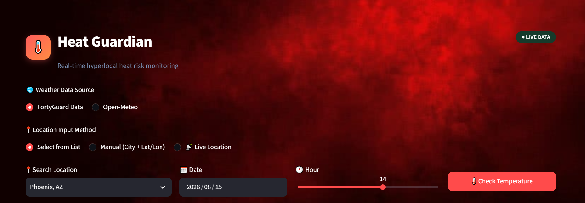
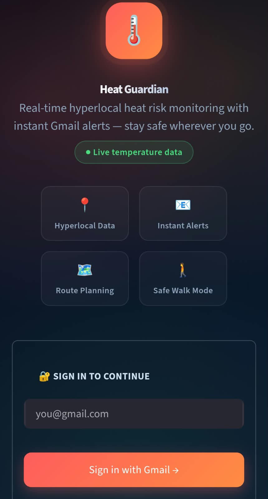
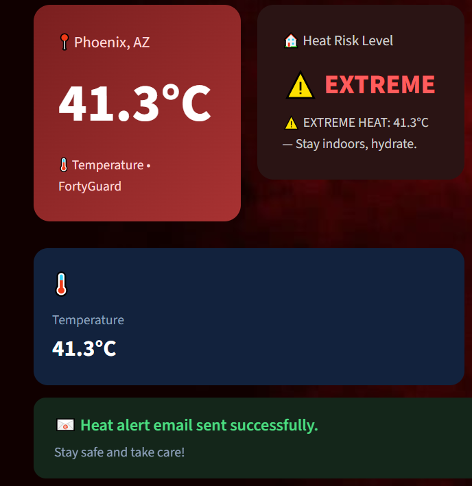
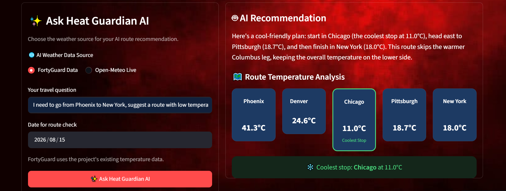
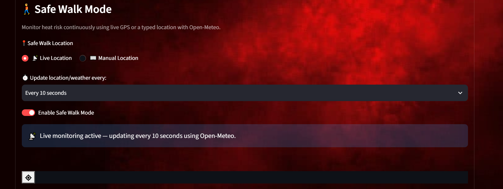
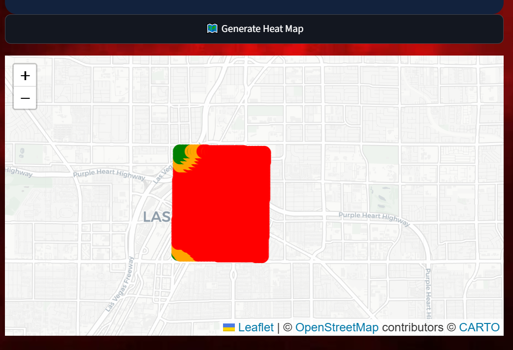

# 🌡️ Heat Guardian

**Real-time, Hyperlocal, Point base Temperature, 2m temperature, Forecast, live location--heat-risk monitoring — powered by FortyGuard's Temperature Intelligence and Bonus Open Meteo.**
 
Built for **FortyGuard Hackathon '26** — **Track 6**: Agentic AI **primary**, **Track 1**: Resilient Cities & Infrastructure, **Track 4** Government and Environment as a bonus angle.

**Note** It can send you a message that rate limit reach beacuse I use Open Meteo free feature. If you see loc error at Safe walk just turn off and then on the Safe walk button or refresh the page. These things are just for guidiance it is possible that you will not see any of these errors. The app is **100 percent working and tested and the proof is available in the video** link below. 

**FOR BETTER LOOK OPEN THE APP IN DARK MODE**

 **GitHub Repo:** [github.com/Dawood-Ahmad-07/HEAT_GUARDIAN](https://github.com/Dawood-Ahmad-07/HEAT_GUARDIAN) &nbsp;
 
 **LinkedIn:** [linkedin.com/in/dawood-ahmad-b16bba378](https://www.linkedin.com/in/dawood-ahmad-b16bba378)
 
 **Live App Demo:** https://heatguardian-hhw5fzxqbzthrjt5qujn9f.streamlit.app/

**YouTube Video link**
https://youtu.be/nnEvlIDI4Cw?si=5XwNE8LkPKs3uZHR

  

---

## 📋 Overview

| **Field** | **Details** |
|---|---|
| **Project** | Heat Guardian |
| **Author** | Dawood Ahmad |
| **Primary Track** | Track 6 — Agentic AI |
| **Secondary Track** | Track 1 and 4 — Resilient Cities & Infrastructure, Government and environment|
| **Core Data Source** | FortyGuard Temperature API (`/v1/heatmap`) |
| **Environmental Data** | FortyGuard Environmental Parameters (`/v1/env_params`) (point-based temperature, including 2m temperature) |
| **Fallback Data Source** | Open-Meteo (free, no API key required, global coverage) |
| **Reasoning Engine** | Groq — `openai/gpt-oss-20b` |
| **Frontend** | Streamlit |

---

## 🎯 Hackathon Track Alignment

Heat Guardian was built agent-first, so it maps directly onto **Track 6**, and its outputs are reframable across most of the other tracks with **zero fictional claims** — every ✅ below is a feature that exists in the shipped app today, not a roadmap promise.

### ✅ Track 6 — Agentic Track (Primary Match)

| **Track Requirement** | **Match** | **In Heat Guardian** |
|---|:---:|---|
| Goal-driven agent that takes a plain-language brief, chooses/sequences the right endpoints, and returns a ranked, justified plan | ✅ | **AI Route-Planning Agent** **With Forecast** — accepts a free-form question (e.g. *"Phoenix to New York, suggest a route with low temperature"*), extracts entities via regex, independently picks FortyGuard vs. Open-Meteo, ranks every stop by temperature, and returns a Groq-generated recommendation with reasoning |
| Monitoring agent that sweeps current conditions on its own schedule and fires alerts/actions on threshold crossing | ✅ | **Safe Walk Monitoring Agent** — polls the user's **live GPS** on a user-set interval (10 sec → 1 hr) via `st_autorefresh` and autonomously emails the user the instant risk crosses High/Extreme, unattended |
| Tool-using assistant whose API calls and reasoning are auditable, not a black box | ✅ | **Duplicate-Aware Alerting Agent** (`alert_key` gate) makes and shows a genuine suppress-or-fire judgment on every single reading — a visible decision trail, not a silent threshold check |

### ✅ Track 1 — Resilient Cities & Infrastructure (Strong Bonus Match)

| **Track Requirement** | **Match** | **In Heat Guardian** |
|---|:---:|---|
| Cool-route planner returning lowest-heat-exposure path between two points using hourly heatmaps | ✅ | **AI Route-Planning Agent** ranks every stop on a route by hyperlocal FortyGuard temperature and returns the coolest path with justification |
| Risk-colored map giving planners/residents at-a-glance visibility of dangerous zones | ✅ | **2 m-resolution Folium heat map** across 24 US cities + any manual location |

### ✅ Track 4 — Government & Environment (Bonus Match)

| **Track Requirement** | **Match** | **In Heat Guardian** |
|---|:---:|---|
| Worker-safety alerting service warning outdoor crews when a site crosses a heat threshold | ✅ | **Safe Walk Monitoring Agent**, **Forecast** reframed for construction crews, delivery riders, or field workers — identical threshold-triggered auto-email logic, no rebuild needed |

## 🧠 What It Does

Heat Guardian doesn't just display a temperature — it **watches, reasons, and acts**. A user signs in with Gmail, selects a location, and from that point forward three autonomous agents take over:

- One **plans low-heat routes** on request.
- One **continuously monitors** the user's live location and emails them the moment conditions turn dangerous.
- One **decides — every single time** — whether a new alert is genuinely warranted or just noise.

  
  

---

## 🤖 Track 6 — Agentic AI (Primary)

Judges look for genuine **perceive → reason → act** loops that run without a human in the loop at each step — not a chatbot wrapper. Heat Guardian implements three such agents.

| **Agent** | **Perceives** | **Reasons** | **Acts** |
|---|---|---|---|
| **AI Route-Planning Agent** `route_planner.py` | Free-form natural-language questions (e.g. *"Phoenix to New York, suggest a route with low temperature"*) via regex-based entity extraction — no fixed template required | Independently selects FortyGuard vs. Open-Meteo depending on whether the question needs live/forecast data or hyperlocal historical data | Queries every stop, ranks by temperature, and returns a synthesized natural-language recommendation via a Groq LLM — a justified decision, not just raw numbers |
| **Safe Walk Monitoring Agent** (continuous loop) | The user's live GPS or fixed location, re-sampled on a user-chosen interval (10 sec → 1 hr) via `st_autorefresh` | Evaluates each fetched temperature reading against Normal / High / Extreme risk thresholds | Sends an email autonomously the instant risk crosses into High or Extreme — zero further input from the user once the loop is started |
| **Duplicate-Aware Alerting Agent** (`alert_key` gate) | Every new temperature reading | Determines whether the reading constitutes new information worth an alert, or a repeat that should be suppressed | Either fires or withholds the email — a genuine judgment call applied at every check, not a blunt "temp > X → email" rule |

  

  

**Safe Walk Mode**

Safe Walk Mode is built for anyone who wants to be automatically warned if their current location turns dangerously hot — without having to keep checking the app themselves. It's aimed at people walking, working, or spending time outdoors: students, elderly users, delivery riders, and outdoor workers.

**How it works**

1.The user enables Safe Walk Mode and picks a check interval (10 sec → 1 hr).

2.While the app tab stays open, it automatically re-checks the temperature at that interval using the device's live location.

3.Since FortyGuard's API doesn't yet support live GPS polling, Safe Walk automatically switches to Open-Meteo for this real-time, location-based tracking — so live monitoring still works globally.
Each reading is classified as Normal, High, or Extreme risk.

4.If the risk crosses into High or Extreme, the app sends an automatic email alert to the user's Gmail — without them needing to press anything.

5.Repeat alerts for the same ongoing condition are suppressed, so the user isn't spammed every refresh cycle.

**Why this counts as agentic, not just "an app that calls an LLM":** the Safe Walk agent is given an intent once (*"watch over me"*) and then perceives, decides, and acts repeatedly and unattended for as long as it runs — the defining property of an agent loop, not a single request/response exchange.

---

## 🏙️ Track 1 — Resilient Cities & Infrastructure (Bonus)

| **Capability** | **City-Resilience Relevance** |
|---|---|
| **Hyperlocal heat map** (FortyGuard `/v1/heatmap`, 2 m resolution) | Street-level heat visibility for 24 US cities plus any manual US location — the granularity real urban planning requires, not a citywide average. |
| **Safe Walk Mode** | Functions as pedestrian-protection infrastructure — the same category of intervention a city public-health department would want deployed at scale |
| **Risk-colored Folium maps** | At-a-glance visibility for residents, planners, or emergency services into which parts of a city are currently dangerous |
| **Cool-route planning** | Reframable as guidance for outdoor workers, delivery routes, or transit planning to minimize city-wide heat exposure |
| **US-only + `2021-01-01` → today compliance, automatic Open-Meteo fallback** | Respects FortyGuard's data-coverage rules and degrades gracefully instead of failing outside them |

  

---

## 🗺️ Dashboard Walkthrough

| **Step** | **What Happens** |
|---|---|
| **1. Sign In** | Gmail-gated entry point — this email becomes the destination for all future alerts |
| **2. Choose Location** | Dropdown (24 US cities) · Manual city + lat/lon · Live GPS |
| **3. Choose Data Source** | FortyGuard (hyperlocal) or Open-Meteo (global fallback) — user can override the agent's default |
| **4. View Risk** | Temperature card + color-coded risk card (Normal / High / Extreme) + stat card |
| **5. On-Demand Heat Map** | Separate button, kept decoupled from the fast temperature check for performance |
| **6. Ask the AI** | Natural-language route question → agent reasons → ranked route + coolest stop |
| **7. Enable Safe Walk** | Continuous unattended monitoring with automatic email alerts on risk escalation |

---

## 🏗️ Architecture

| **Layer** | **Technology** |
|---|---|
| **Frontend** | Streamlit, custom CSS (glassmorphism, dark navy theme, animated backgrounds) |
| **Hyperlocal Heat Data** | FortyGuard Temperature API — `/v1/heatmap` (async submit-and-poll) |
| **Temperature Data** | FortyGuard Environmental Parameters API |
| **Fallback / Live Global Weather** | Open-Meteo — current conditions, 16-day forecast, and geocoding |
| **Agentic Reasoning** | Groq — `openai/gpt-oss-20b` |
| **Maps** | Folium + `streamlit-folium` |
| **Continuous Monitoring** | `streamlit-autorefresh` |
| **Alerts** | Email, tied to the Gmail identity captured at sign-in 
---
---

### Impact & Relevance

Heat isn't a niche problem — it's the one environmental hazard **every single person interacts with every day**, regardless of age, income, or location. Heat Guardian is built so its relevance scales across all of them:

- **A child walking to school** gets a safer, cooler route without needing to understand a single heatmap.
- **An elderly resident**, who is medically the most heat-vulnerable group, gets an automatic email the moment conditions turn dangerous — no app-checking required.
- **An outdoor worker or delivery rider** gets the same Safe Walk loop repurposed as a shift-safety monitor, with zero extra setup.
- **A parent** can enable Safe Walk for a family member and be alerted the instant risk escalates, from anywhere.
- **A city or logistics company** gets a commercially adoptable product on day one: the hyperlocal map, cool-route agent, and threshold-alerting engine already work end-to-end against a live, deployed app — not a mockup.

It isn't solving heat for "a user persona," it's solving it for the full range of people heat actually harms — which is the entire population of a hot city.

### Technical Execution 

- **Real, working integrations** — FortyGuard's async submit-and-poll `/v1/heatmap` endpoint for hyperlocal 2 m data, with an automatic, transparent fallback to Open-Meteo when a location or date falls outside FortyGuard's coverage rules.
- **A genuine continuous agent loop** — `streamlit-autorefresh` drives real unattended monitoring, not a button the user has to press repeatedly.
- **LLM reasoning wired into a decision pipeline**, not bolted on — Groq's `openai/gpt-oss-20b` receives ranked route data and returns a justified recommendation, and the alerting agent's `alert_key` gate is a real duplicate-suppression mechanism, not a stub.
- **Deployed and reachable right now** at the live demo link above — judges can test the actual product, not slides describing it.
- **Graceful degradation** — the US-only + `2021-01-01`→today compliance check and automatic fallback mean the app never hard-fails outside FortyGuard's data-coverage rules.

### Innovation 

- **Three cooperating agents, not one** — a planning agent, a monitoring agent, and a suppression agent each own a distinct decision, which is a materially different design from the common "single chatbot wrapper" hackathon pattern.
- **Duplicate-aware alerting is a genuine UX innovation**: most heat-alert prototypes spam the user every refresh cycle; Heat Guardian's `alert_key` gate treats "should I even send this" as its own reasoning step, which is what makes the alerts trustworthy enough to actually leave on.
- **Dual-source strategy** — FortyGuard for hyperlocal precision, Open-Meteo for global reach — lets the same product serve both a "street-level urban planning" use case and a "just tell me if it's safe outside" everyday use case.

### Communication

- A structured, walkthrough-driven README (this document) with numbered dashboard steps and screenshots for every major screen.
- A live, clickable **demo and public repo linked** at the top of the document, with a **YouTube video**
---

**Built by Dawood Ahmad for FortyGuard Hackathon '26.**
